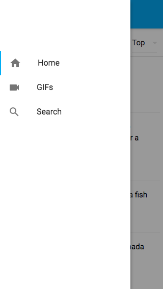

# Reddit web app using Vue.js 2

> A mobile-first reddit web app using vue-cli webpack template + vue-router 2 + Vuex + axios + sass

> Data from [reddit-dev](https://github.com/reddit/reddit/wiki)

> UI Framework using Muse-UI

### [LIVE DEMO](https://yujiahaol68.github.io/reddit-app/)

## Preview





## Build Setup

``` bash
# install dependencies
npm install

# serve with hot reload at localhost:8080
npm run dev

# build for production with minification
npm run build
```

## Feature

+ Modern JavaScript syntax with ES6 via [babel](http://babeljs.io/)
+ vue-cli webpack template
+ API request seperated
+ [Muse-UI](https://museui.github.io)
+ Make full use of computed property
+ CSS with [Sass](http://sass-lang.com/)
+ Transition using third-party css class [Animate.css](https://github.com/daneden/animate.css/)
+ No Ads

## Function

+ Infinite scroll
+ different channel and sort method to choose
+ Image View
+ SPA experience

## Coming soon

+ OAuth  
+ Detail page
+ GIF preview playing
+ ...

## Thanks

+ vue.js
+ vue-cli
+ axios
+ vue-touch

For detailed explanation on how things work, checkout the [guide](http://vuejs-templates.github.io/webpack/) and [docs for vue-loader](http://vuejs.github.io/vue-loader).
